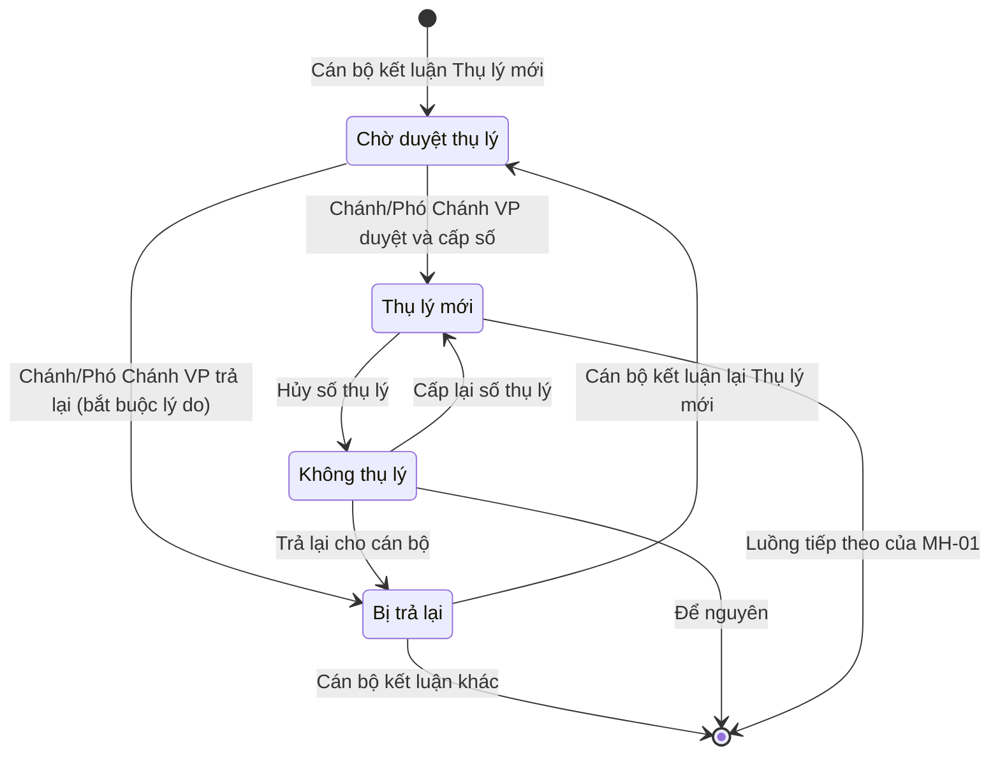

# TÀI LIỆU ĐẶC TẢ YÊU CẦU PHẦN MỀM (SRS)
## MÀN HÌNH: DANH SÁCH ĐƠN — TAB CHỜ DUYỆT THỤ LÝ (MH-01-CDTL)

**Phạm vi**: TAND cấp tỉnh — phân hệ Hành chính tư pháp (HCTP)
**Phiên bản**: 1.1 — 28/09/2026
**Tài liệu cha**: [SRS_DanhSachDon_ChiTiet.md](./SRS_DanhSachDon_ChiTiet.md) (MH-01). Những gì tài liệu này không nhắc tới thì áp dụng đúng như MH-01.
**Bản demo tham chiếu**: `app/tinh/AppTinh.tsx` (hàm `duyetThuLyCapSo`, hằng `CHO_DUYET_THU_LY`), `app/tinh/ChiSoTrangChu.tsx`, `app/tinh/duyetThuLyStore.ts`. Demo mới làm tới UC-CDTL-01; các phần bổ sung ở bản 1.1 chưa có trong demo.

| Phiên bản | Ngày | Nội dung |
|---|---|---|
| 1.0 | 28/09/2026 | Bản đầu: tab, nguồn đơn, UC duyệt và cấp số. |
| 1.1 | 28/09/2026 | Bỏ quy tắc tính số thụ lý (đã định nghĩa ở tài liệu chung). Thêm: trả lại đơn cho cán bộ (UC-CDTL-02), xử lý sau hủy số thụ lý (UC-CDTL-03), khóa chỉnh sửa đơn chờ duyệt, thứ tự cấp số, sắp xếp, thông báo, chỉ số Trang chủ, xử lý lỗi, tiêu chí nghiệm thu. Sửa: ô Loại văn bản không bị ẩn. Chốt: đơn chờ duyệt vẫn đếm hạn; Bị trả lại hiện ở tab Đơn trả lại, màu đỏ. |

---

### 1. Giới thiệu và Mục đích sử dụng

Ở TAND cấp tỉnh, số thụ lý **không** cấp ngay khi cán bộ kết luận đơn "Thụ lý mới". Đơn chuyển sang trạng thái **Chờ duyệt thụ lý**. Chánh/Phó Chánh văn phòng xem xét ở tab này rồi **duyệt và cấp số**, hoặc **trả lại** đơn cho cán bộ. **Số thụ lý chỉ được cấp tại bước duyệt.**

Mục đích:
- Số thụ lý do **một chỗ duy nhất** cấp — không còn gõ tay rải rác ở nhiều popup.
- Chánh/Phó Chánh văn phòng có một danh sách riêng các đơn đang chờ mình, duyệt hoặc trả lại được từng đơn hay hàng loạt.

Quy tắc tính số thụ lý (định dạng, cách đánh số, xử lý số đã hủy) đã được định nghĩa ở tài liệu chung, **không thuộc phạm vi** tài liệu này.

> Khác cấp tối cao: ở TAND tối cao, kết luận "Thụ lý mới" cấp số ngay, không có trạng thái và tab này.

---

### 2. Vai trò và điều kiện hiển thị tab

- Tab **Chờ duyệt thụ lý** chỉ hiện với vai trò **Chánh/Phó Chánh văn phòng** (mã vai trò `pho-vp`, cấu hình `TI-HCTP-CVP` trong `app/roleConfig.ts`).
- Chánh và Phó Chánh văn phòng **có quyền như nhau** trên tab này (Phó Chánh làm theo ủy quyền của Chánh). Lịch sử luôn ghi **họ tên và chức danh thật** của người thao tác.
- Tab nằm ở **vị trí thứ hai**, thay chỗ tab **Đơn của tôi**. Vai trò này không trực tiếp xử lý đơn nên không cần tab Đơn của tôi. Dải tab của vai trò này:
  `Tổng số · Chờ duyệt thụ lý · Đơn Thụ lý · Chưa đủ điều kiện · Hết thời hạn kháng nghị · Khác · Đơn trả lại`
- Với mọi vai trò khác, vị trí thứ hai vẫn là **Đơn của tôi**. Họ vẫn thấy đơn chờ duyệt trong tab **Tổng số** nhưng không thao tác được (xem mục 6.3).
- Số cạnh nhãn tab = số đơn đang ở trạng thái Chờ duyệt thụ lý, **tính theo bộ lọc đang áp dụng** (giống quy tắc đếm của MH-01 mục 2).

---

### 3. Nguồn đơn vào tab

Một đơn vào trạng thái **Chờ duyệt thụ lý** qua đúng một trong ba đường dưới đây. Cả ba đều **chỉ ghi kết luận, không sinh số thụ lý**.

| # | Nơi thao tác | Điều kiện chọn | Thông báo / ghi chú hiển thị |
|---|---|---|---|
| 1 | Popup **Thêm kết quả giải quyết** (Action Menu của MH-01) | Kết quả xử lý = **Chuyển đơn** → Trạng thái đơn = **Đơn đủ điều kiện** → Thụ lý đơn = **Thụ lý mới** | Hộp ghi chú dưới ô Thụ lý đơn: *"Số thụ lý và ngày thụ lý do Chánh/Phó Chánh văn phòng cấp khi duyệt. Đơn sẽ chuyển sang trạng thái Chờ duyệt thụ lý."* |
| 2 | Popup **Bổ sung tài liệu** (đơn đang Chưa đủ điều kiện) | Kết quả = đủ điều kiện, Thụ lý đơn = **Thụ lý mới** | Thông báo: *"Đã ghi nhận bổ sung tài liệu — đơn chuyển sang Chờ duyệt thụ lý, chờ cấp số thụ lý."* |
| 3 | Khối **Kết quả xử lý** trong form Thêm mới / Sửa đơn | Như dòng 1 | Như dòng 1 |

Đơn **Bị trả lại** (mục 8) cũng vào lại tab này khi cán bộ kết luận lại "Thụ lý mới" theo một trong ba đường trên.

Khi vào trạng thái này, đơn phải thỏa:
- `giaiQuyet.nhan = "Chờ duyệt thụ lý"`, màu `#b45309`.
- **Chưa có** số thụ lý (`stl` rỗng) và **chưa có** ngày thụ lý.
- Lịch sử xử lý HCTP có thêm mốc **Kết luận Thụ lý mới**, ghi nhận **thời điểm cán bộ kết luận Thụ lý mới** (ngày giờ), cán bộ kết luận và ghi chú kết luận. Mốc này bắt buộc với **cả ba đường**, kể cả Bổ sung tài liệu.
- Về khối lượng công việc: đơn được tính là **đã xử lý xong** đối với cán bộ tiếp nhận, và chuyển thành **việc cần làm** của Chánh/Phó Chánh văn phòng (xem mục 10.2).

Các kết luận khác ở cùng các popup trên **không** đi qua tab này: "Đã thụ lý" giữ trạng thái Đã thụ lý; "Xin ý kiến lãnh đạo" / "Không" giữ trạng thái tương ứng; "Đơn không đủ điều kiện" → Chưa đủ điều kiện.

---

### 4. Điều kiện lọc và sắp xếp

#### 4.1. Lọc
- Tab lấy mọi đơn có trạng thái giải quyết là **Chờ duyệt thụ lý**, trong phạm vi đơn vị của người đăng nhập.
- Bộ lọc cơ bản, bộ lọc nâng cao và ô **Loại văn bản** của MH-01 (mục 3) áp dụng đầy đủ.
- Các danh sách giá trị của bộ lọc **Trạng thái** / **Thụ lý đơn** phải có thêm hai giá trị **Chờ duyệt thụ lý** và **Bị trả lại**.
- Bộ lọc tiến độ (Đã giải quyết / Chưa giải quyết) của tab Đơn của tôi **không hiện** ở tab này.
- Đơn Chờ duyệt thụ lý **không** rơi vào tab **Khác** (MH-01 mục 2 phải bổ sung trạng thái này vào danh sách loại trừ của tab Khác) và không thuộc tab **Đơn Thụ lý** cho tới khi được duyệt.
- Đơn **Bị trả lại** hiện ở tab **Đơn trả lại** (cùng với đơn "Trả lại đơn" cho đương sự), và **không** rơi vào tab **Khác**. MH-01 mục 2 phải sửa điều kiện của hai tab này tương ứng.

#### 4.2. Sắp xếp
- Trong tab Chờ duyệt thụ lý: theo **thời điểm nhận đơn** tăng dần (đơn nhận trước ở trên). Cùng thời điểm thì theo mã đơn tăng dần. Đây cũng là thứ tự cấp số khi duyệt hàng loạt (mục 7.2).
- Ở các tab có lẫn nhiều trạng thái (Tổng số…), đơn **Chờ duyệt thụ lý luôn được đẩy lên đầu** danh sách, với mọi vai trò. Trong nhóm này cũng sắp theo thời điểm nhận đơn tăng dần; phần còn lại giữ thứ tự của MH-01.

#### 4.3. Chọn dòng
- Ô **Chọn tất cả** chỉ chọn các dòng **đang hiển thị** (sau lọc, trên trang hiện tại), không chọn toàn bộ dữ liệu.

---

### 5. Thanh công cụ

| Thành phần | Ở tab Chờ duyệt thụ lý |
|---|---|
| Ô chọn **Loại văn bản** | Hiện — như MH-01 |
| **+ Thêm mới** | Ẩn |
| **Lưu số văn bản và in báo cáo** | Ẩn |
| **Duyệt & cấp số thụ lý (N)** | **Hiện** — nút chính. N = số dòng đang tick. Tắt khi chưa tick dòng nào |
| **Trả lại (N)** | **Hiện** — mở popup Trả lại đơn cho cán bộ (UC-CDTL-02). Tắt khi chưa tick dòng nào. Nút này **thay** nút Trả lại của MH-01 ở tab này |
| **In danh sách** | Hiện — như MH-01 mục 6.2: in các dòng đang tick, không tick thì in toàn bộ đơn của tab theo bộ lọc |

Tab này **không** có chức năng phân công cán bộ; việc đó do Trưởng phòng làm ở tab Tổng số.

---

### 6. Bảng dữ liệu

Cột và cách hiển thị giống MH-01 mục 4, trừ các điểm dưới đây.

#### 6.1. Cột Thông tin giải quyết
Đơn **Chờ duyệt thụ lý**:
- Dòng trạng thái: **Chờ duyệt thụ lý**, màu `#b45309`.
- Dòng phụ ngay dưới: *"Chưa cấp số — chờ Chánh/Phó Chánh văn phòng duyệt"* — để người xem không hiểu nhầm là số thụ lý bị mất.
- Không hiện Số thụ lý, Ngày thụ lý.

Đơn **Bị trả lại** (hiện ở các tab khác, xem mục 8.3):
- Dòng trạng thái: **Bị trả lại**, màu đỏ `#dc2626` (khác đỏ `#c0392b` của Không thụ lý để hai trạng thái không lẫn nhau).
- Ngay dưới, **luôn** hiện: *"Người trả: {họ tên} — {ngày trả}"*, rồi *"Lý do: {lý do trả lại}"*. Dòng người trả giúp phân biệt với các trạng thái "Bị trả lại" / "Đã trả lại HCTP" ở nơi khác của MH-01, nên không đổi tên trạng thái.

Liên kết **Lịch sử xử lý HCTP** và **Danh sách văn bản** giữ nguyên như MH-01 mục 5.

#### 6.2. Action Menu (nút ···)
Với vai trò Chánh/Phó Chánh văn phòng:

| Mục | Vị trí | Điều kiện hiện |
|---|---|---|
| **Duyệt thụ lý & cấp số** | Đầu menu | Đơn đang Chờ duyệt thụ lý |
| **Trả lại cho cán bộ** | Ngay sau mục trên | Đơn đang Chờ duyệt thụ lý |
| **Cấp lại số thụ lý** | Đầu menu | Đơn đang Không thụ lý **do hủy số thụ lý** (UC-CDTL-03) |
| **Trả lại cho cán bộ** | Ngay sau mục trên | Như dòng trên |

Hai mục cho đơn Chờ duyệt thụ lý hiện ở **mọi tab** có đơn đó (Chờ duyệt thụ lý, Tổng số), không chỉ ở tab Chờ duyệt thụ lý. Các mục xem (Xem chi tiết, Xem hồ sơ đơn…) giữ theo MH-01.

#### 6.3. Khóa chỉnh sửa đơn đang chờ duyệt
Khi đơn đang ở trạng thái **Chờ duyệt thụ lý**, **không ai** được thay đổi nội dung hay kết luận của đơn. Các mục làm thay đổi đơn **không hiện** trong Action Menu và phải bị chặn ở server (BR-05): Sửa, Thêm kết quả giải quyết, Bổ sung tài liệu, Chuyển đơn, Ghép đơn, Xóa.

Trưởng phòng cũng **không được phân công / phân công lại cán bộ** cho đơn đang Chờ duyệt thụ lý. Ở tab Tổng số, dòng chờ duyệt không tick được để phân công. Nếu vẫn chọn lẫn đơn chờ duyệt vào danh sách phân công thì hệ thống bỏ qua các đơn đó. Nhờ vậy, khi trả lại, đơn luôn về đúng cán bộ đã kết luận.

Chỉ có hai thao tác thay đổi được trạng thái đơn: **Duyệt** (UC-CDTL-01) và **Trả lại** (UC-CDTL-02). Muốn đổi kết luận thì Chánh/Phó Chánh văn phòng trả lại, sau đó cán bộ sửa.

---

### 7. UC-CDTL-01: Duyệt thụ lý và cấp số thụ lý

#### 7.1. Cách kích hoạt
- **Từng đơn**: Action Menu → **Duyệt thụ lý & cấp số**.
- **Hàng loạt**: tick một hoặc nhiều dòng → nút **Duyệt & cấp số thụ lý (N)** trên thanh công cụ.

Cả hai cách dùng **chung một xử lý**, nên kết quả không thể lệch nhau. Bấm là thực hiện ngay, **không có popup xác nhận**.

#### 7.2. Xử lý
1. Trong các đơn được chọn, chỉ giữ những đơn **đang ở trạng thái Chờ duyệt thụ lý** (kiểm tra tại server lúc ghi). Đơn khác trạng thái — kể cả đơn vừa bị người khác duyệt hoặc trả lại — bị bỏ qua, không báo lỗi.
2. Nếu không còn đơn nào: hiện thông báo *"Không có đơn nào đang chờ duyệt thụ lý."* và dừng.
3. Sắp các đơn còn lại theo **thời điểm nhận đơn** tăng dần (cùng thời điểm thì theo mã đơn), rồi cấp số thụ lý lần lượt theo thứ tự đó, theo quy tắc cấp số chung.
4. Với mỗi đơn được duyệt:
   - Trạng thái → **Thụ lý mới**, màu `#27ae60`.
   - Số thụ lý = số vừa cấp; Ngày thụ lý = ngày duyệt (dd/mm/yyyy), lấy theo **giờ máy chủ** (GMT+7). Không chặn duyệt vào ngày nghỉ, ngày lễ.
   - Thêm mốc lịch sử xử lý HCTP: hành động **Duyệt thụ lý & cấp số**; cán bộ = họ tên và chức danh của người đang đăng nhập; thời điểm = lúc duyệt; ghi chú = *"Cấp số thụ lý {số}"*.
   - **Không** tự sinh văn bản nào (thông báo thụ lý…). Văn bản vẫn lập theo luồng thường của MH-01.
5. Bỏ chọn toàn bộ dòng.
6. Hiện thông báo:
   - 1 đơn: *"Đã duyệt 1 đơn — cấp số thụ lý {số}."*
   - Nhiều đơn: *"Đã duyệt {n} đơn — cấp số thụ lý {số đầu} … {số cuối}."*
7. Gửi thông báo cho cán bộ đã kết luận (mục 10.1).

#### 7.3. Xử lý lỗi
- Thao tác là **nguyên khối** (BR-03): nếu lỗi ở bất kỳ đơn nào (mất kết nối, lỗi server…), **không đơn nào** được duyệt hay cấp số, dữ liệu giữ nguyên như trước khi bấm.
- Hiện thông báo lỗi: *"Duyệt không thành công — chưa đơn nào được cấp số. Vui lòng thử lại."* Giữ nguyên các dòng đang tick để người dùng bấm lại.
- Trong lúc đang xử lý, nút Duyệt và mục menu bị khóa để tránh bấm hai lần.

#### 7.4. Kết quả trên màn hình
- Đơn rời tab Chờ duyệt thụ lý; số đếm tab giảm tương ứng.
- Đơn xuất hiện ở tab **Đơn Thụ lý**; cột Thông tin giải quyết hiện **Thụ lý mới**, **Số thụ lý**, **Ngày thụ lý**.
- Sau bước này đơn đi tiếp luồng thường của MH-01 (phân công thẩm phán, hủy số thụ lý…).

---

### 8. UC-CDTL-02: Trả lại đơn cho cán bộ

#### 8.1. Cách kích hoạt
- **Từng đơn**: Action Menu → **Trả lại cho cán bộ**.
- **Hàng loạt**: tick một hoặc nhiều dòng → nút **Trả lại (N)** trên thanh công cụ.
- Cũng dùng cho đơn đã hủy số thụ lý (UC-CDTL-03).

#### 8.2. Popup Trả lại đơn cho cán bộ
- Tiêu đề: **Trả lại đơn cho cán bộ**. Hiện số đơn và danh sách mã đơn sẽ trả.
- Ô **Lý do trả lại** (nhiều dòng) — **bắt buộc**. Để trống hoặc chỉ có khoảng trắng thì nút Trả lại bị tắt; nếu vẫn gửi lên thì báo *"Vui lòng nhập lý do trả lại."*
- Trả lại hàng loạt dùng **chung một lý do** cho mọi đơn được chọn.
- Nút **Hủy** đóng popup, không thay đổi gì. Nút **Trả lại** thực hiện xử lý ở mục 8.3.

#### 8.3. Xử lý
1. Chỉ giữ các đơn đang Chờ duyệt thụ lý, hoặc đang Không thụ lý sau hủy số thụ lý. Đơn khác bị bỏ qua, không báo lỗi. Không còn đơn nào thì báo *"Không có đơn nào để trả lại."* và dừng.
2. Với mỗi đơn:
   - Trạng thái → **Bị trả lại**, màu `#dc2626`.
   - Ghi **người trả** (họ tên, chức danh), **ngày trả**, **lý do trả lại**.
   - Đơn về **cán bộ đã kết luận Thụ lý mới** (người ở mốc Kết luận Thụ lý mới gần nhất) và hiện trong tab **Đơn của tôi** của cán bộ đó, đồng thời ở tab **Đơn trả lại** (mục 4.1).
   - Thêm mốc lịch sử: hành động **Trả lại cho cán bộ**; cán bộ = người trả; thời điểm = lúc trả; ghi chú = *"Lý do: {lý do}"*.
   - Không có số thụ lý, không có ngày thụ lý.
3. Đóng popup, bỏ chọn toàn bộ dòng, hiện thông báo *"Đã trả lại {n} đơn cho cán bộ."*
4. Gửi thông báo cho cán bộ nhận lại đơn (mục 10.1).

Xử lý lỗi giống mục 7.3 (nguyên khối). Câu thông báo: *"Trả lại không thành công. Vui lòng thử lại."*

#### 8.4. Sau khi bị trả lại
- Đơn Bị trả lại **mở khóa** chỉnh sửa với cán bộ được trả về: được Sửa, Thêm kết quả giải quyết, Bổ sung tài liệu… như đơn đang xử lý bình thường.
- Nếu cán bộ kết luận lại **Thụ lý mới**, đơn quay về **Chờ duyệt thụ lý** (mục 3). Nếu kết luận khác, đơn sang trạng thái tương ứng.
- Đơn Bị trả lại được tính lại là **việc chưa xong** của cán bộ đó.
- Lịch sử giữ đủ các lần trả lại trước đó.

---

### 9. UC-CDTL-03: Xử lý đơn sau khi hủy số thụ lý

Hủy số thụ lý vẫn theo MH-01: đơn chuyển sang **Không thụ lý**, xóa số thụ lý, ghi mốc lịch sử "Hủy số thụ lý". Sau đó Chánh/Phó Chánh văn phòng có thể:

| Lựa chọn | Kết quả |
|---|---|
| Để nguyên | Đơn giữ trạng thái **Không thụ lý** |
| **Cấp lại số thụ lý** | Chạy các bước 3–7 của mục 7.2 cho đơn đó: trạng thái → **Thụ lý mới**, số thụ lý mới theo quy tắc cấp số chung, ngày thụ lý = ngày cấp lại. Mốc lịch sử: **Cấp lại số thụ lý**, ghi chú *"Cấp số thụ lý {số mới} (thay số đã hủy {số cũ})"* |
| **Trả lại cho cán bộ** | Như UC-CDTL-02: đơn → **Bị trả lại**, bắt buộc nhập lý do |

Chỉ áp dụng cho đơn đang Không thụ lý **do hủy số thụ lý**. Hệ thống cần lưu lý do vào trạng thái này (ví dụ cờ `doHuySoThuLy`), không suy ra từ "mốc lịch sử gần nhất", vì sau khi hủy số vẫn có thể phát sinh mốc khác (lập văn bản…). Cả hai thao tác chỉ dành cho Chánh/Phó Chánh văn phòng và chỉ thực hiện từng đơn qua Action Menu. Nút Trả lại (N) trên thanh công cụ chỉ có ở tab Chờ duyệt thụ lý.

---

### 10. Thông báo và chỉ số Trang chủ

#### 10.1. Thông báo trong hệ thống

| Sự kiện | Người nhận | Nội dung |
|---|---|---|
| Đơn vào Chờ duyệt thụ lý | Chánh và các Phó Chánh văn phòng của đơn vị | *"Có đơn mới chờ duyệt thụ lý: {mã đơn}."* Bấm vào thì mở tab Chờ duyệt thụ lý |
| Đơn được duyệt / cấp lại số | Cán bộ đã kết luận Thụ lý mới | *"Đơn {mã đơn} đã được cấp số thụ lý {số}."* |
| Đơn bị trả lại | Cán bộ được trả về | *"Đơn {mã đơn} bị trả lại bởi {người trả}. Lý do: {lý do}."* Bấm vào thì mở đơn |

Khi duyệt hoặc trả lại hàng loạt, mỗi cán bộ nhận **một** thông báo gộp cho các đơn của mình.

#### 10.2. Chỉ số khối lượng công việc (Trang chủ)
- Đơn **Chờ duyệt thụ lý**: tính là **đã xử lý xong** với cán bộ tiếp nhận, và là **việc cần làm** của Chánh/Phó Chánh văn phòng.
- Trang chủ của vai trò Chánh/Phó Chánh văn phòng có chỉ số **"Chờ duyệt thụ lý: {n}"**. Bấm vào thì mở tab Chờ duyệt thụ lý.
- Đơn **Bị trả lại**: tính lại là việc chưa xong của cán bộ được trả về.

#### 10.3. Thời hạn giải quyết
- Đơn Chờ duyệt thụ lý **vẫn tiếp tục đếm hạn** giải quyết theo quy tắc chung của MH-01 / Trang chủ. Thời gian chờ duyệt **không** được trừ khỏi hạn. Đơn chờ duyệt vẫn có thể bị tính là sắp đến hạn hoặc quá hạn.
- Đơn Bị trả lại cũng tiếp tục đếm hạn như vậy.
- Hai trạng thái Chờ duyệt thụ lý và Bị trả lại **không** thuộc nhóm tạm dừng đếm hạn (`TRANG_THAI_TAM_DUNG_HAN`).

---

### 11. Quy tắc nghiệp vụ

| Mã | Quy tắc |
|---|---|
| BR-01 | Bước duyệt ở tab này (và bước Cấp lại số thụ lý) là **nơi duy nhất** sinh số thụ lý ở TAND cấp tỉnh. Không popup nào khác được ghi số thụ lý cho đơn Thụ lý mới. |
| BR-02 | Kết quả duyệt và trả lại phải **lưu bền**. Tải lại trang không được làm đơn lùi về Chờ duyệt thụ lý. (Demo lưu tạm vào `localStorage` qua `duyetThuLyStore.ts`; bản thật lưu vào CSDL.) |
| BR-03 | Duyệt hàng loạt và trả lại hàng loạt là **thao tác nguyên khối**: lỗi giữa chừng thì không đơn nào bị thay đổi. |
| BR-04 | Duyệt hàng loạt cấp số theo **thời điểm nhận đơn** tăng dần; cùng thời điểm thì theo mã đơn tăng dần. |
| BR-05 | Kiểm tra quyền và trạng thái ở **server**: chỉ vai trò Chánh/Phó Chánh văn phòng được duyệt, trả lại, cấp lại số; chỉ đơn đúng trạng thái; mọi thao tác sửa hoặc phân công đơn Chờ duyệt thụ lý bị từ chối (mục 6.3). Ẩn nút ở giao diện không thay cho kiểm tra này. |
| BR-06 | Trả lại **bắt buộc có lý do** (không rỗng sau khi bỏ khoảng trắng). Lý do lưu cùng người trả và ngày trả. |
| BR-07 | **Xung đột**: nếu cùng một đơn đồng thời nhận thao tác Duyệt và Trả lại, kết quả cuối cùng là **Bị trả lại**. Đơn không được cấp số, và thao tác Duyệt bỏ qua đơn đó mà không báo lỗi. |
| BR-08 | Duyệt không tự sinh văn bản. |

---

### 12. Phân quyền

| Vai trò | Thấy tab | Thấy đơn chờ duyệt | Duyệt & cấp số | Trả lại | Cấp lại số sau hủy | Sửa / phân công đơn chờ duyệt |
|---|---|---|---|---|---|---|
| Chánh/Phó Chánh văn phòng (`pho-vp`) | Có | Có | Có | Có | Có | Không |
| Trưởng phòng | Không | Có — ở tab Tổng số | Không | Không | Không | Không |
| Cán bộ tiếp nhận, cán bộ thụ lý, các vai trò khác | Không | Có — ở tab Tổng số | Không | Không | Không | Không |

---

### 13. Sơ đồ trạng thái

Phiên bản này **không có** popup duyệt và **không** cho sửa tay số hoặc ngày thụ lý.

---

### 14. Tiêu chí nghiệm thu

| Mã | Cho trước | Khi | Thì |
|---|---|---|---|
| AC-01 | Cán bộ mở popup Thêm kết quả giải quyết | Chọn Chuyển đơn → Đơn đủ điều kiện → Thụ lý mới và lưu | Đơn ở trạng thái Chờ duyệt thụ lý, không có số và ngày thụ lý, lịch sử có mốc Kết luận Thụ lý mới kèm thời điểm kết luận |
| AC-02 | Đơn Chưa đủ điều kiện | Bổ sung tài liệu, kết quả đủ điều kiện, Thụ lý mới | Như AC-01; hiện thông báo của mục 3 dòng 2 |
| AC-03 | Đăng nhập vai trò `pho-vp` | Mở Danh sách đơn | Tab thứ hai là Chờ duyệt thụ lý, số đếm đúng theo bộ lọc; không có tab Đơn của tôi |
| AC-04 | Đăng nhập vai trò khác | Mở Danh sách đơn | Tab thứ hai là Đơn của tôi; đơn chờ duyệt thấy ở Tổng số, xếp đầu danh sách, không có mục Duyệt / Trả lại / Sửa |
| AC-05 | Tab Chờ duyệt thụ lý có ≥ 2 đơn | Mở tab | Đơn sắp theo thời điểm nhận đơn tăng dần; ô Loại văn bản hiện; không có bộ lọc tiến độ, Thêm mới, Lưu số văn bản |
| AC-06 | Tick 3 đơn chờ duyệt, theo thứ tự tick bất kỳ | Bấm Duyệt & cấp số thụ lý (3) | Cả 3 đơn sang Thụ lý mới; số cấp theo thời điểm nhận đơn tăng dần; ngày thụ lý = hôm nay; mỗi đơn có mốc Duyệt thụ lý & cấp số ghi đúng họ tên, chức danh người duyệt; hiện thông báo "Đã duyệt 3 đơn — …"; không sinh văn bản |
| AC-07 | Tick 3 đơn ở tab Chờ duyệt thụ lý; trước khi bấm, 1 đơn đã được người khác duyệt | Bấm Duyệt & cấp số thụ lý (3) | Chỉ 2 đơn còn chờ được duyệt; đơn kia giữ nguyên số đã cấp, không bị cấp số lần hai; không báo lỗi |
| AC-08 | Server lỗi khi duyệt 3 đơn | Bấm Duyệt | Không đơn nào đổi trạng thái; hiện thông báo lỗi của mục 7.3; các dòng vẫn được tick |
| AC-09 | Đơn đã duyệt | Tải lại trang | Đơn vẫn là Thụ lý mới với đúng số và ngày thụ lý |
| AC-10 | Đơn chờ duyệt | Mở popup Trả lại, để trống lý do | Nút Trả lại bị tắt; không có thay đổi |
| AC-11 | Đơn chờ duyệt | Trả lại với lý do "Thiếu bản án" | Đơn → Bị trả lại, hiện người trả, ngày trả, lý do; đơn có trong Đơn của tôi của cán bộ đã kết luận; lịch sử có mốc Trả lại cho cán bộ; cán bộ nhận thông báo |
| AC-12 | Đơn Bị trả lại | Cán bộ sửa và kết luận lại Thụ lý mới | Đơn quay về Chờ duyệt thụ lý; lịch sử giữ lần trả lại trước |
| AC-13 | Đơn chờ duyệt | Cán bộ (hoặc bất kỳ ai) mở Action Menu, hoặc gọi thẳng API sửa đơn | Không có mục Sửa / Thêm kết quả / Bổ sung tài liệu / Chuyển đơn / Ghép / Xóa; server từ chối lời gọi sửa |
| AC-14 | Người dùng không phải `pho-vp` | Gọi thẳng API duyệt, trả lại hoặc cấp lại số | Server từ chối, dữ liệu không đổi |
| AC-15 | Hai người thao tác cùng lúc trên một đơn: A duyệt, B trả lại | Cả hai gửi lên | Đơn là Bị trả lại, không có số thụ lý; A không nhận thông báo lỗi (nếu đó là đơn duy nhất A chọn thì A thấy thông báo "Không có đơn nào đang chờ duyệt thụ lý.") |
| AC-16 | Đơn Thụ lý mới đã hủy số (đang Không thụ lý) | `pho-vp` chọn Cấp lại số thụ lý | Đơn → Thụ lý mới với số mới, ngày thụ lý = hôm nay; lịch sử ghi số mới và số đã hủy |
| AC-17 | Như AC-16 | `pho-vp` chọn Trả lại cho cán bộ kèm lý do | Đơn → Bị trả lại như AC-11 |
| AC-18 | Có đơn mới vào Chờ duyệt thụ lý | — | Chánh và Phó Chánh VP nhận thông báo; chỉ số "Chờ duyệt thụ lý" trên Trang chủ tăng; chỉ số việc chưa xong của cán bộ tiếp nhận giảm |
| AC-19 | Ngày duyệt là Chủ nhật | Duyệt đơn | Duyệt thành công, ngày thụ lý = ngày Chủ nhật đó |
| AC-20 | Đơn chờ duyệt đã quá hạn giải quyết | Mở Trang chủ / Danh sách đơn | Đơn vẫn được tính là quá hạn |
| AC-21 | Đơn vừa bị trả lại | Mở tab Đơn trả lại và tab Khác | Đơn có ở tab Đơn trả lại, trạng thái màu đỏ `#dc2626`; không có ở tab Khác |
| AC-22 | Trưởng phòng ở tab Tổng số, có đơn chờ duyệt | Chọn đơn để Phân công cán bộ | Không tick được dòng chờ duyệt; nếu gọi thẳng API phân công thì server từ chối |

---

### 15. Liên kết chéo

- Màn Danh sách đơn: [SRS_DanhSachDon_ChiTiet.md](./SRS_DanhSachDon_ChiTiet.md) — MH-01 mục 2 (tab), mục 3 (bộ lọc), mục 4 (bảng), mục 6.2 (in danh sách), thao tác Hủy số thụ lý.
- Bảng màu và danh sách trạng thái thụ lý: `app/tinh/ChiSoTrangChu.tsx` (`TRANG_THAI_THU_LY`), khớp `docs/man-hinh-danh-sach-don.md` mục 5.2. Cả hai nơi cần bổ sung trạng thái **Bị trả lại** (`#dc2626`).
- Lưu tạm kết quả duyệt ở bản demo: `app/tinh/duyetThuLyStore.ts`.
