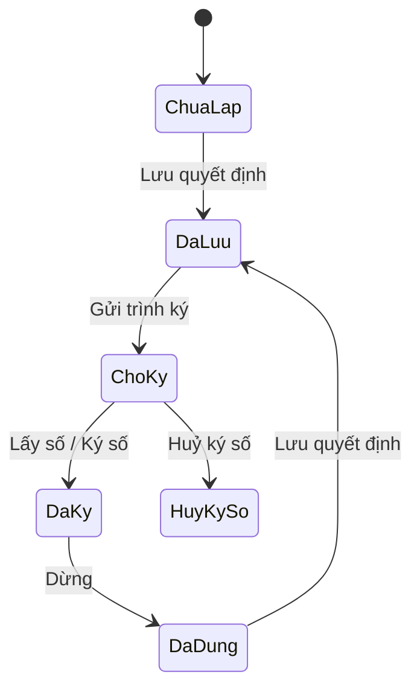

# TÀI LIỆU ĐẶC TẢ YÊU CẦU PHẦN MỀM (SRS)
## CHỨC NĂNG: TẠO QUYẾT ĐỊNH PHÂN CÔNG THẨM PHÁN (MH-PCTP-QĐ)

**Phạm vi**: TAND cấp tỉnh — màn Phân công thẩm phán, tab **Quản lý kết quả phân công**. TANDTC **không** có chức năng này.
**Phiên bản**: 1.0 — 28/09/2026
**Bản demo tham chiếu**:
- Nút bấm: `app/components/PhanCongThamPhanScreen.tsx` (prop `onTaoQuyetDinh`)
- Popup: `app/tinh/QuyetDinhPhanCong.tsx`
- Gắn vào màn: `app/tinh/PhanCongThamPhanView.tsx`
- Biểu mẫu A4: `app/tinh/components/DocumentNumberingModal.tsx` (`ToTrinhPhanCongPreview`, nhánh `quyetDinh`)
- Đồng bộ kho văn bản: `app/tinh/components/QuanLyVanBan.tsx` (`taoQuyetDinhPhanCong`), `app/tinh/AppTinh.tsx` (`dongBoQDPhanCong`)

---

### 1. Giới thiệu và Mục đích sử dụng

Sau khi đơn đã được phân công thẩm phán, TAND cấp tỉnh phải ban hành **Quyết định phân công thẩm phán giải quyết vụ án**. Chức năng này cho cán bộ:
- Lập quyết định cho một hoặc nhiều đơn đã phân công — **mỗi đơn một quyết định**.
- Đi hết vòng đời văn bản: Lưu → Gửi trình ký → Lấy số / Ký số, hoặc Huỷ ký số / Dừng.
- Xem và in biểu mẫu quyết định, mở quyết định trong màn Danh sách văn bản.

---

### 2. Nút "Tạo Quyết định phân công"

#### 2.1. Vị trí và điều kiện hiển thị
- Màn **Phân công thẩm phán**, tab **Quản lý kết quả phân công**, thanh thao tác phía trên bảng.
- Chỉ hiện ở **TAND cấp tỉnh**. Màn dùng chung với TANDTC; ở TANDTC không truyền `onTaoQuyetDinh` nên nút không hiện.
- Nhãn nút:
  - Chưa tick dòng nào: **Tạo Quyết định phân công**
  - Có tick: **Tạo Quyết định phân công (N đơn đã chọn)**

#### 2.2. Tập đơn đưa vào popup
1. Có tick dòng: lấy các dòng đang tick **và đã có thẩm phán**.
2. Không tick dòng nào: lấy **toàn bộ** đơn đang hiển thị theo bộ lọc của tab **và đã có thẩm phán**.
3. Nếu tập rỗng: hiện hộp thông báo **"Chưa có kết quả phân công"** và không mở popup:
   - Có tick: *"Các đơn đang tick chưa có thẩm phán được phân công nên chưa thể tạo quyết định."*
   - Không tick: *"Chưa có đơn nào được phân công thẩm phán nên chưa thể tạo quyết định."*
4. Ngược lại: mở popup **Tạo quyết định phân công thẩm phán** (mục 3).

---

### 3. Popup "Tạo quyết định phân công thẩm phán"

#### 3.1. Bố cục
- Popup giữa màn hình. Bấm nút **X** để đóng.
- **Header**: tiêu đề *"Tạo quyết định phân công thẩm phán"*, dòng phụ *"Mỗi quyết định gắn với một đơn · {n} đơn đã phân công"*.
- **Cột trái — Danh sách đơn ({n})**. Mỗi dòng: số thụ lý (đậm), người đứng đơn, nhãn trạng thái quyết định (mục 4). Bấm một dòng để chọn đơn đang làm việc; Mặc định chọn đơn đầu tiên.
- **Cột phải — Form quyết định** của đơn đang chọn (mục 3.2) và các nút thao tác (mục 3.3).
- Nếu tập đơn rỗng: vùng phải hiện *"Không có đơn nào đã được phân công thẩm phán."*

#### 3.2. Các trường của form

| Trường | Nguồn | Sửa được | Ghi chú |
|---|---|---|---|
| Số quyết định | Hệ thống | Không | Trước khi lấy số: **số tạm**. Sau khi lấy số: **số chính thức** (mục 5) |
| Ngày ban hành | Mặc định ngày hiện tại | Có | DatePicker `DD/MM/YYYY`, không cho để trống |
| Đơn vị soạn thảo | Mặc định tên tòa của người đăng nhập | Có | In ở góc trái biểu mẫu |
| Số thụ lý | Đơn | Không | |
| Loại án | Đơn | Không | |
| Thẩm phán được phân công * | Kết quả phân công | Không | Muốn đổi thẩm phán thì sửa phân công ở bảng, không sửa ở đây |
| Lý do phân công | Kết quả phân công | Không | |
| Ghi chú | Người dùng nhập | Có | Không bắt buộc; in dưới Điều 3 của biểu mẫu nếu có |

Các trường **Ngày ban hành**, **Đơn vị soạn thảo**, **Ghi chú** chỉ sửa được khi quyết định ở trạng thái **Chưa lập**, **Đã lưu** hoặc **Đã dừng**. Từ **Chờ ký** trở đi, form chỉ đọc.

#### 3.3. Nút thao tác
Nút chính thay đổi theo trạng thái của quyết định đang chọn — mỗi lúc chỉ có đúng bước kế tiếp:

| Trạng thái hiện tại | Nút hiện | Kết quả |
|---|---|---|
| Chưa lập, Đã dừng | **Lưu quyết định** | → Đã lưu. Thông báo *"Đã lưu quyết định {số} cho đơn {số thụ lý}."* |
| Đã lưu | **Gửi trình ký** | → Chờ ký. Thông báo *"Đã gửi trình ký quyết định phân công thành công!"* |
| Chờ ký | **Lấy số / Ký số** và **Huỷ ký số** | Lấy số / Ký số → Đã ký, cấp số chính thức. Thông báo *"Đã lấy số quyết định và ký số thành công."* Trong lúc chờ, nút hiện *"Đang lấy số..."* và bị khoá. Huỷ ký số → Huỷ ký số, trả về số tạm. Thông báo *"Đã huỷ ký số quyết định."* (màu đỏ) |
| Đã ký | **Dừng** | → Đã dừng, trả về số tạm, bỏ số đã lấy. Thông báo *"Đã dừng quyết định, có thể chỉnh sửa lại."* |
| Huỷ ký số | (không có nút chính) | Xem mục 4 |

Hai nút phụ luôn hiện dưới nút chính:
- **Xem biểu mẫu** — mở biểu mẫu A4 (mục 6).
- **Danh sách văn bản** — đóng popup, mở màn Danh sách văn bản lọc theo số thụ lý của đơn.

Cả hai **chỉ bật khi quyết định đã lưu** (trạng thái Đã lưu, Chờ ký, Đã ký, Huỷ ký số). Khi chưa lưu: nút xám, tooltip *"Phải lưu quyết định trước khi xem biểu mẫu"*, và dòng nhắc màu đỏ *"Phải lưu quyết định trước khi xem biểu mẫu."*

Hộp thông báo kết quả thao tác hiện ở đầu form, màu xanh (thành công) hoặc đỏ (huỷ ký số).

---

### 4. Trạng thái quyết định

| Mã | Nhãn | Màu nhãn | Trạng thái ở kho văn bản |
|---|---|---|---|
| `mo` | Chưa lập | Xám | Nháp |
| `daLuu` | Đã lưu | Xanh dương | Nháp |
| `choKy` | Chờ ký | Vàng | Chờ ký |
| `daKy` | Đã ký | Xanh lá | Đã ban hành |
| `huyKy` | Huỷ ký số | Đỏ | Nháp |
| `dung` | Đã dừng | Xám | Đã huỷ |

Từ **Huỷ ký số**, bản thật phải cho **Gửi trình ký lại** (quyết định vẫn là bản đã lưu, chỉ mất chữ ký). Bản demo chưa có nút ở trạng thái này — xem mục 9.

---

### 5. Quy tắc số quyết định

| Mã | Quy tắc |
|---|---|
| BR-01 | Trước khi ký, quyết định mang **số tạm** dạng `QDTĐ{3 chữ số}/{năm}`, ví dụ `QDTĐ001/2026`. Số tạm chỉ để nhận diện bản nháp, không phải số văn bản. |
| BR-02 | **Số chính thức** chỉ cấp ở bước **Lấy số / Ký số**, dạng `{3 chữ số}/{năm}/QD-{ký hiệu tòa}`, ví dụ `001/2026/QD-TAND-HN`. |
| BR-03 | Số chính thức **liên tục và không trùng trong sổ quyết định của tòa theo năm**. Backend cấp số bằng sequence hoặc transaction có khoá — không tính ở phía client. |
| BR-04 | **Huỷ ký số** và **Dừng** trả quyết định về số tạm. Số chính thức đã cấp bị **thu hồi, không cấp lại** cho quyết định khác; sổ số phải ghi nhận số bị huỷ. |
| BR-05 | Mỗi đơn có **tối đa một** quyết định phân công đang hiệu lực. Bản ghi quyết định khoá theo đơn: lưu lại thì ghi đè đúng bản ghi cũ, không sinh bản ghi mới. |

---

### 6. Biểu mẫu Quyết định (Xem biểu mẫu)

Mở dạng popup rộng 900px, trang A4 trên nền xám. Header có ba nút: **Xem trong danh sách văn bản**, **In**, **Đóng**. Khi in chỉ in trang A4, ẩn toàn bộ giao diện còn lại.

Nội dung trang A4:
1. Góc trái: **Đơn vị soạn thảo** (chữ hoa, đậm) và gạch chân. Góc phải: *CỘNG HÒA XÃ HỘI CHỦ NGHĨA VIỆT NAM / Độc lập - Tự do - Hạnh phúc*.
2. Tiêu đề: *QUYẾT ĐỊNH — Về việc phân công thẩm phán giải quyết vụ án*.
3. **Số:** số quyết định hiện tại (số tạm hoặc số chính thức).
4. **Về:** *Việc phân công thẩm phán giải quyết vụ án {loại án} số {số thụ lý} thụ lý ngày {ngày thụ lý} của {đơn vị soạn thảo}.*
5. Căn cứ pháp lý và *Theo đề nghị của {phòng đề nghị}*.
6. **Điều 1.** Phân công thẩm phán **{thẩm phán}** giải quyết vụ án nêu trên, thời hạn giải quyết theo quy định chung.
   **Điều 2.** Trách nhiệm của thẩm phán được phân công.
   **Điều 3.** Hiệu lực kể từ ngày ký.
7. **Ghi chú** (in nghiêng) nếu trường Ghi chú có nội dung.
8. **Nơi nhận:** *Như Điều 3; Thẩm phán {thẩm phán}*. Khối ký bên phải: chức danh người ký; dòng chữ ký hiện *"Đã ký số"* khi trạng thái là **Đã ký**, ngược lại là dòng chấm.
9. Địa danh, ngày ban hành.

Loại án, phòng đề nghị, chức danh người ký và địa danh lấy theo đơn và tòa đang đăng nhập — **không** cố định như bản demo (xem mục 9).

---

### 7. Đồng bộ với kho văn bản (màn Danh sách văn bản)

Mỗi lần trạng thái quyết định đổi, hệ thống ghi quyết định vào kho văn bản chung để nó hiện ở màn **Danh sách văn bản** và mở được bằng luồng xem văn bản sẵn có:

| Trường ở kho văn bản | Giá trị |
|---|---|
| Id bản ghi | Ổn định theo đơn (demo: `vb-qd-{số thụ lý}`) — lưu lại thì ghi đè |
| Trích yếu | *Quyết định phân công thẩm phán – {số thụ lý}* |
| Loại văn bản | Quyết định phân công thẩm phán |
| Số văn bản, trạng thái số | Số hiện tại; *tạm* khi chưa ký, *chính thức* khi đã ký |
| Ngày ban hành | Chỉ có khi đã ký |
| Trạng thái | Theo bảng mục 4 |
| Nội dung phiên bản 1 | Nội dung quyết định dựng từ đơn + form (giống biểu mẫu mục 6) |
| Lịch sử | Tạo, Lấy số tạm (khi chưa ký), Trình (từ Chờ ký), Ký (khi Đã ký) |
| Đơn đính kèm | Số thụ lý, người đứng đơn, số BA/QĐ, hình thức đơn |

---

### 8. Phân quyền và yêu cầu phi chức năng

- Người lập quyết định (Lưu, Gửi trình ký, Dừng): cán bộ HCTP của tòa cấp tỉnh.
- **Lấy số / Ký số** và **Huỷ ký số**: chỉ người có thẩm quyền ký quyết định phân công của tòa. Ở bản thật, hai thao tác này nằm ở màn ký của người ký (qua luồng trình ký), không phải của người lập.
- Mọi thao tác kiểm tra quyền và trạng thái ở **server**; ẩn/khoá nút ở giao diện chỉ là hiển thị.
- Trạng thái quyết định phải **lưu bền**: đóng popup rồi mở lại, hoặc tải lại trang, thì mỗi đơn vẫn hiện đúng trạng thái và số hiện có của quyết định.
- Mọi đổi trạng thái ghi nhật ký: người, thời điểm, trạng thái trước/sau, số văn bản trước/sau.

---

### 9. Khác biệt của bản demo — không mang sang bản thật

| # | Bản demo | Bản thật |
|---|---|---|
| 1 | Người lập tự bấm **Lấy số / Ký số** ngay trong popup, không qua người ký | Ký và lấy số do người có thẩm quyền làm ở màn ký (mục 8) |
| 2 | Số tạm đánh lại từ `QDTĐ001` mỗi lần mở popup; số chính thức đếm riêng cho từng đơn nên hai đơn có thể cùng ra `001/2026/QD-TAND-HN` | Theo BR-01 → BR-04 |
| 3 | Trạng thái quyết định chỉ nằm trong popup: mở lại popup thì mọi đơn về "Chưa lập" (dù kho văn bản đã có bản ghi) | Đọc lại trạng thái đã lưu (mục 8) |
| 4 | Ở trạng thái Huỷ ký số không còn nút nào để đi tiếp | Có nút **Gửi trình ký** lại (mục 4) |
| 5 | Form vẫn sửa được ngày ban hành, đơn vị, ghi chú khi đã Chờ ký / Đã ký | Chỉ đọc từ Chờ ký (mục 3.2) |
| 6 | Biểu mẫu cố định *"vụ án dân sự"*, *"Phòng Thẩm phán dân sự"*, địa danh *"Hà Nội"*; đơn vị soạn thảo mặc định *"Toà án nhân dân tỉnh Hà Nội"* | Lấy theo loại án của đơn và tòa đang đăng nhập (mục 6) |
| 7 | Khối ký in *"CHÁNH ÁN"*, trong khi luồng ký gắn ở kho văn bản là Trưởng phòng duyệt → Phó Chánh văn phòng ký → Phó Chánh án bút phê | Chức danh trên biểu mẫu phải khớp người ký thật của luồng |
| 8 | Nhãn trường viết sai *"Thẩm phân được phân công"* | *"Thẩm phán được phân công"* |

---

### 10. Liên kết chéo

- Màn Phân công thẩm phán (tab, bảng, phân công ngẫu nhiên / chỉ định): `app/components/PhanCongThamPhanScreen.tsx`.
- Màn Danh sách văn bản và luồng ký: `app/tinh/components/QuanLyVanBan.tsx` (`luongToTrinhPhanCong`, `taoQuyetDinhPhanCong`).
